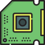

# Network Interface Card (NIC)
## What's a NIC? 

- **Function:** A NIC (Network Interface Card) or network adapter is a crucial piece of hardware that allows your computer to connect to a network. Think of it as a translator, converting your computer's data into a format suitable for network transmission (like Ethernet or Wi-Fi).

- **Identification:** Each NIC has a unique identifier called a MAC address. This 6-byte address acts like a fingerprint, allowing routers and switches on the network to recognize your specific computer.

## Types of NICs

### Wired NIC
- usually use ethernet cables to connect to network.
### Wireless NIC
- usually use antennas to connect to network

___
>[!IMPORTANT]
>- Every NIC has a unique MAC address that consists of 12 digits.
>
